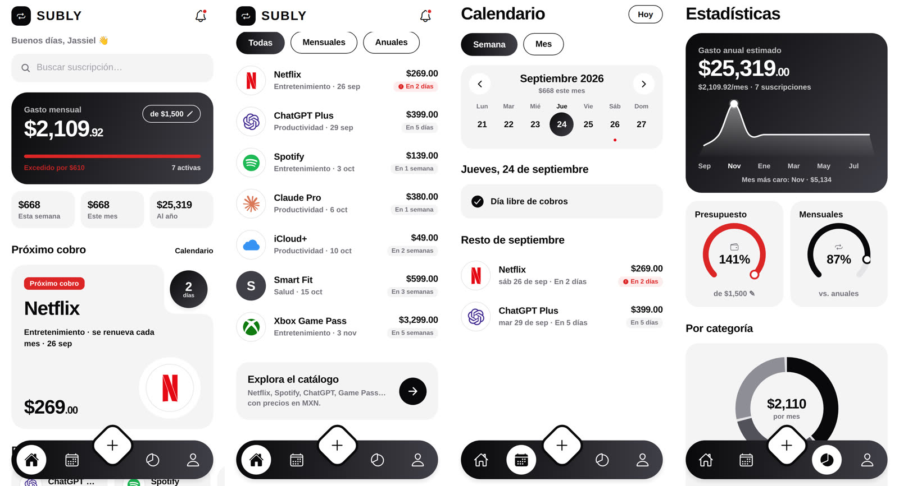
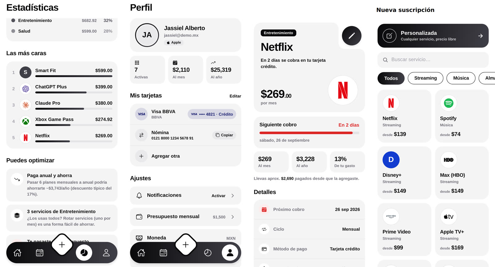
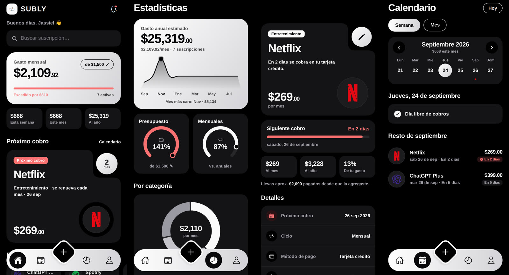
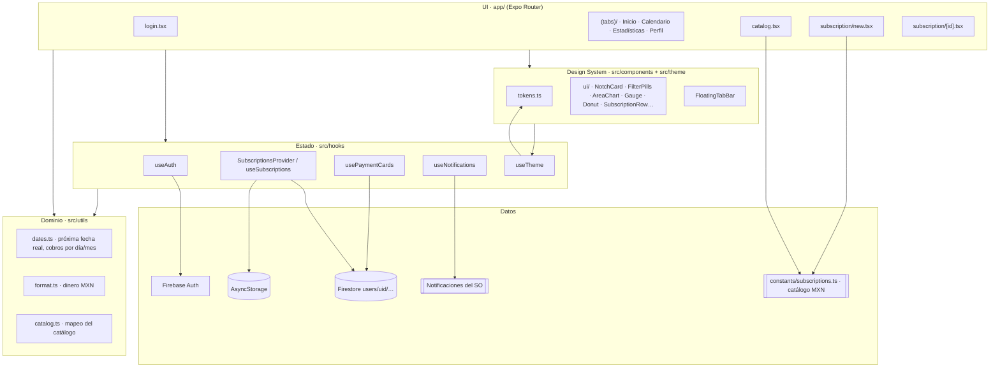
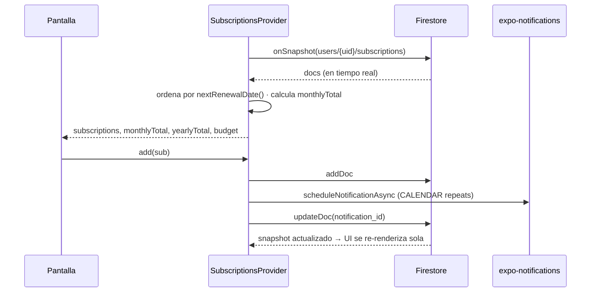

# Subly · SuscripcionesApp

> Todas tus suscripciones, un solo lugar. Controla cuánto gastas, cuándo te cobran y dónde puedes ahorrar.

App móvil (iOS / Android) hecha con **Expo SDK 57 + Expo Router + Firebase** para registrar suscripciones (Netflix, Spotify, ChatGPT, gimnasio…), ver el gasto mensual/anual, recibir recordatorios antes de cada cobro y vincular cada servicio a la tarjeta o CLABE con la que se paga.

**Modo claro** — Inicio, lista con filtros, Calendario y Estadísticas



**Modo claro** — Estadísticas (ranking y tips), Perfil, Detalle y Alta



**Modo oscuro** (paleta invertida)



> Las capturas se tomaron en Chromium (build web) con datos de ejemplo. En iOS/Android se ven con la tipografía del sistema (SF Pro / Roboto).

---

## Índice

1. [Stack técnico](#1-stack-técnico)
2. [Cómo correrla](#2-cómo-correrla)
3. [Arquitectura](#3-arquitectura)
4. [Modelo de datos](#4-modelo-de-datos)
5. [Programación: módulos y convenciones](#5-programación-módulos-y-convenciones)
6. [Diseño: Subly Design System](#6-diseño-subly-design-system)
7. [Funcionamiento pantalla por pantalla](#7-funcionamiento-pantalla-por-pantalla)
8. [Qué cambió en el rediseño 2.0](#8-qué-cambió-en-el-rediseño-20)
9. [Deuda técnica y riesgos conocidos](#9-deuda-técnica-y-riesgos-conocidos)
10. [Roadmap: mejoras y nuevos módulos](#10-roadmap-mejoras-y-nuevos-módulos)

---

## 1. Stack técnico

| Capa | Tecnología | Para qué |
|---|---|---|
| Runtime | **Expo SDK 57**, React Native 0.86, React 19.2, Hermes | App nativa iOS/Android con un solo código |
| Navegación | **expo-router 57** (file-based) · `expo-router/js-tabs` | Rutas = archivos en `app/`, tabs con tab bar propia |
| Backend | **Firebase** 11 (Auth + Firestore) | Login y datos en la nube, en tiempo real (`onSnapshot`) |
| Auth | Google (`expo-auth-session`), Apple (`expo-apple-authentication`), Email/Password | Inicio de sesión |
| Notificaciones | `expo-notifications` (trigger `CALENDAR` repetitivo) | Recordatorio 1 día antes del cobro |
| UI | `expo-linear-gradient`, `react-native-svg`, `@expo/vector-icons` (Ionicons), `simple-icons` | Gradientes, gráficas SVG, iconos y logos de marcas |
| Persistencia local | `@react-native-async-storage/async-storage` | Sesión de Firebase y presupuesto |
| Otros | `@react-native-community/datetimepicker`, `expo-clipboard`, `expo-glass-effect` | Fechas, copiar CLABE, Liquid Glass (opcional) |
| Build | **EAS Build** (`eas.json`: development / preview / production) | Dev client y binarios de tienda |

---

## 2. Cómo correrla

```bash
npm install
npx expo start            # Expo Go o dev client
npx expo start --ios      # simulador iOS
npx expo start --android  # emulador Android
npx tsc --noEmit          # typecheck (debe salir limpio)
```

**Dev build** (necesario para Apple Sign-In real, NativeTabs y notificaciones completas):

```bash
eas build --profile development --platform ios
```

> `AGENTS.md` pide leer la documentación versionada de Expo antes de escribir código. El proyecto está en **SDK 57** (ver `package.json`); la guía apunta a v54, así que conviene actualizar ese enlace a `https://docs.expo.dev/versions/v57.0.0/`.

---

## 3. Arquitectura

### 3.1 Vista general



### 3.2 Capas

| Capa | Carpeta | Regla |
|---|---|---|
| **Rutas / pantallas** | `app/` | Una pantalla por archivo. Solo orquestan: leen hooks, calculan vistas con `useMemo` y componen componentes del design system. |
| **Design system** | `src/theme/`, `src/components/ui/` | Sin lógica de negocio ni acceso a datos. Todo color sale de `useTheme()`. |
| **Componentes de feature** | `src/components/` | `BudgetModal`, `CatalogBrowser`, `CardPickerModal`, `FloatingTabBar`: reutilizables entre pantallas y con algo de lógica. |
| **Estado / datos** | `src/hooks/`, `src/firebase/` | Los hooks exponen datos y acciones; `src/firebase/*` es el único lugar que habla con Firestore. |
| **Dominio puro** | `src/utils/` | Funciones puras (fechas, dinero, catálogo). Fáciles de probar con tests unitarios. |
| **Config** | `src/config/ui.ts`, `app.json`, `eas.json` | Flags de UI y configuración nativa. |

### 3.3 Estructura de carpetas

```
app/
├── _layout.tsx               # Stack raíz · AuthGate · SubscriptionsProvider · headers con tema
├── login.tsx                 # Google / Apple / Email
├── catalog.tsx               # Explorar catálogo (antes era pestaña)
├── (tabs)/
│   ├── _layout.tsx           # FloatingTabBar (default) o NativeTabs (opt-in)
│   ├── index.tsx             # Inicio
│   ├── calendar.tsx          # Calendario semana/mes
│   ├── explore.tsx           # Estadísticas
│   └── profile.tsx           # Perfil, tarjetas y ajustes
└── subscription/
    ├── new.tsx               # Alta (catálogo → formulario) y edición (?id=)
    └── [id].tsx              # Detalle
src/
├── theme/tokens.ts           # Colores claro/oscuro, gradientes, radios, tipografía, sombras
├── config/ui.ts              # USE_NATIVE_TABS
├── components/
│   ├── ui/                   # Design system (primitives, charts, NotchCard, SubscriptionTile)
│   ├── FloatingTabBar.tsx
│   ├── BudgetModal.tsx
│   ├── CatalogBrowser.tsx
│   └── CardPickerModal.tsx
├── hooks/                    # useAuth, useSubscriptions, usePaymentCards, useNotifications, useTheme
├── firebase/                 # init + CRUD Firestore
├── utils/                    # dates, format, catalog, brandIcons, env
└── types/                    # Subscription, PaymentCard, labels y colores de categoría
constants/subscriptions.ts    # Catálogo de servicios con planes y precios MXN
```

### 3.4 Navegación

```
Stack (raíz)
├── login                         (fade, sin header)
├── (tabs)                        Tabs con FloatingTabBar
│   ├── index      Inicio
│   ├── calendar   Calendario
│   ├── [ + ]      FAB → /subscription/new
│   ├── explore    Estadísticas
│   └── profile    Perfil
├── catalog                       header "Explorar catálogo"
├── subscription/new              modal (catálogo → formulario)
└── subscription/[id]             detalle
```

**AuthGate** (`app/_layout.tsx`) escucha `onAuthStateChanged`: sin sesión → `/login`; con sesión en `/login` → `/`.

**Deep links de alta:** `/subscription/new?catalogId=netflix&planPrice=269&planPeriod=mensual` abre el formulario prellenado; `?custom=true` abre el formulario vacío; `?id=<docId>` edita.

### 3.5 Flujo de datos



- **Una sola fuente de verdad:** Firestore. La UI nunca muta estado local de suscripciones; escribe en Firestore y el `onSnapshot` actualiza a todos.
- **Offline:** con la configuración actual (caché en memoria del SDK web de Firestore) las escrituras se encolan mientras la app sigue abierta y se sincronizan al volver la red; no hay caché persistente entre reinicios (ver roadmap).
- **Presupuesto:** vive en el provider y se persiste en AsyncStorage (`@subs_budget`), por lo que es por dispositivo (ver roadmap).

---

## 4. Modelo de datos

```
users/{uid}/subscriptions/{id}
users/{uid}/paymentCards/{id}
```

**Subscription**

| Campo | Tipo | Notas |
|---|---|---|
| `name` | string | "Netflix" |
| `price` | number | Precio **del ciclo** (mensual o anual) en MXN |
| `billing_cycle` | `'monthly' \| 'yearly'` | |
| `next_renewal` | `YYYY-MM-DD` | **Fecha ancla** capturada por el usuario. La fecha real se calcula con `nextRenewalDate()` |
| `category` | `entertainment \| productivity \| health \| education \| finance \| other` | |
| `color` | hex | Fallback cuando no hay logo de marca |
| `remind_me` | `0 \| 1` | |
| `notification_id` | string \| null | ID de la notificación programada en el dispositivo |
| `payment_method` | `credit_card \| debit_card \| paypal \| bank_transfer \| cash \| other` | |
| `card_id?` | string | Referencia a `paymentCards/{id}` |
| `description?` | string | Notas libres |
| `created_at` | ISO string | |

**PaymentCard**: `alias`, `kind` (`credit|debit|clabe`), `brand` (`visa|mastercard|amex|other`), `last_digits`, `clabe?` (18 dígitos), `bank`, `order?`, `created_at`.

**Catálogo** (`constants/subscriptions.ts`): lista estática de `PredefinedSubscription` con `planes[]` (`precio`, `periodo`, `precioMensual`, `descripcion`) en MXN.

### Reglas de Firestore recomendadas

Cada usuario solo debe poder leer/escribir su propio árbol:

```
rules_version = '2';
service cloud.firestore {
  match /databases/{database}/documents {
    match /users/{uid}/{document=**} {
      allow read, write: if request.auth != null && request.auth.uid == uid;
    }
  }
}
```

---

## 5. Programación: módulos y convenciones

### 5.1 Hooks

| Hook | Expone | Detalle |
|---|---|---|
| `useAuth()` | `{ user, loading }` | `undefined` mientras Firebase resuelve la sesión persistida |
| `useSubscriptions()` | `subscriptions`, `loading`, `monthlyTotal`, `yearlyTotal`, `budget`, `setBudget`, `add`, `update`, `remove`, `setNotifId` | Context global. Ordena por próximo cobro real. Siembra 3 ejemplos (MXN) en cuentas nuevas |
| `usePaymentCards()` | `cards`, `addCard`, `updateCard`, `removeCard` | Listener en `paymentCards` |
| `useScheduleNotification()` / `useCancelNotification()` | funciones | Trigger `CALENDAR` mensual (día) o anual (mes+día) a las 9:00, un día antes |
| `useTheme()` | `{ dark, colors }` | Tokens claro/oscuro según el sistema |
| `useTabBarSpace()` | número | Padding inferior para que el contenido no quede bajo la tab bar flotante |

### 5.2 Lógica de fechas (`src/utils/dates.ts`)

El punto más delicado de una app de suscripciones. Reglas:

- **Todo en hora local a mediodía** (`parseDate('2026-09-24')` → 12:00 local). `toISOString()` está prohibido para fechas: usa UTC y de noche cambia el día.
- **`nextRenewalDate(sub)`**: si la fecha ancla ya pasó, avanza mes a mes (o año a año) hasta hoy o después. Antes, una suscripción capturada hace 3 meses decía "Hoy" para siempre.
- **Fin de mes**: un cobro el día 31 cae el 30 en abril y el 28/29 en febrero (`withClampedDay`).
- **`chargesOn` / `subsOnDate` / `totalForMonth`**: base del calendario y de las gráficas; nunca marcan fechas anteriores a la ancla.
- **`monthlyEquivalent`**: anual / 12, para comparar peras con peras.

### 5.3 Dinero (`src/utils/format.ts`)

`money(1234.5)` → `$1,234.50` · `moneyShort` → `$1,235` · `moneyParts` separa enteros y centavos para los héroes (`$2,109` + `.92` pequeño). Todo en `es-MX` / MXN.

### 5.4 Convenciones

- TypeScript `strict`; `npx tsc --noEmit` debe pasar sin errores.
- Estilos con `StyleSheet.create` al final del archivo; colores **solo** desde `useTheme()` o tokens.
- Nada de `Dimensions` en render salvo grids con ancho fijo; preferir `flex` y `onLayout`.
- Componentes interactivos con `accessibilityRole` / `accessibilityLabel`.
- Textos de UI en español (MX).
- `src/firebase/*` es la única capa que importa `firebase/firestore`.

---

## 6. Diseño: Subly Design System

De las referencias se tomó la **forma** (tarjetas soft con radios grandes, tipografía muy pesada, pills de filtro, tarjeta con muesca, tab bar flotante con botón central), no los colores. La paleta es **blanco y negro**.

### 6.1 Tokens (`src/theme/tokens.ts`)

| Token | Claro | Oscuro | Uso |
|---|---|---|---|
| `bg` | `#FFFFFF` | `#000000` | Fondo de pantalla |
| `surface` | `#F4F4F5` | `#141416` | Tarjetas "soft" |
| `text` / `subtext` / `muted` | `#09090B` / `#71717A` / `#A1A1AA` | `#FAFAFA` / `#A1A1AA` / `#71717A` | Jerarquía de texto |
| `ink` | `#09090B` (negro) | `#FAFAFA` (blanco) | Énfasis: pills activas, tab bar, botones principales, héroes |
| `onInk` | blanco | negro | Texto e iconos sobre `ink` |
| `gradient` | `#09090B → #3F3F46` | `#FFFFFF → #D4D4D8` | Degradado sutil de profundidad en héroes y botones |
| `chart` | 6 grises de negro a gris claro | 6 grises de blanco a grafito | Series de gráficas (dona por categoría) |
| `urgent` / `urgentSoft` | `#DC2626` / `#FDECEC` | `#F87171` / `#2A1215` | **Único color funcional:** cobro en ≤ 3 días o presupuesto excedido |

- **Modo oscuro = paleta invertida:** lo negro pasa a blanco y viceversa (la tab bar, los héroes y las pills activas se vuelven blancos).
- **Logos de marca** conservan su color (son contenido, no UI) sobre un círculo neutro con borde fino.
- Los servicios sin logo usan una letra sobre un tono de gris elegido en el formulario.
- **Radios:** `xs 8 · sm 12 · md 16 · lg 22 · xl 28 · pill`.
- **Tipografía:** fuente del sistema (SF Pro / Roboto) con pesos 800–900 para cifras y títulos. Cifras grandes con centavos más pequeños.
- **Sombras:** `floatShadow()` neutra y suave para elementos flotantes.

### Gráficas: sólo donde aportan

| Pantalla | ¿Gráfica? | Por qué |
|---|---|---|
| **Estadísticas** | Sí: curva de 12 meses, 2 medidores (presupuesto, mensuales vs anuales), dona por categoría, barras del top 5 | Es la pantalla de análisis: comparar y ver tendencias |
| **Inicio** | No: tarjeta negra con el gasto, barra de presupuesto y 3 cifras (semana / mes / año) | Aquí se busca el dato rápido; una curva no dice más que tres números |
| **Detalle** | No: una barra de progreso hasta el siguiente cobro y 3 cifras (mes / año / % del gasto) | Una sola suscripción no tiene tendencia que graficar |
| **Calendario** | No | El propio calendario es la visualización |

### 6.2 Componentes

| Componente | Descripción |
|---|---|
| `NotchCard` | Tarjeta con "mordida" cóncava arriba a la derecha dibujada en SVG, donde vive un círculo negro (días restantes, editar). Patrón de la referencia del corazón. |
| `FloatingTabBar` | Píldora negra (blanca en oscuro), iconos outline invertidos, **círculo que se desliza con spring** a la pestaña activa y **FAB diamante** con contorno para agregar. |
| `FilterPills` | Pills estilo "All / New Car / Used Car": activa rellena en negro, inactivas con contorno. |
| `AreaChart` | Curva suave (Catmull-Rom → Bézier) con relleno degradado y punto resaltado. |
| `Gauge` | Arco de 270° con perilla, para porcentajes (presupuesto, progreso del ciclo). |
| `Donut` | Dona por categorías con separación entre segmentos. |
| `SubscriptionRow` / `UpcomingTile` / `FeaturedSubscriptionCard` | Fila de lista con logo circular, tile del carrusel con barra de progreso del ciclo, tarjeta destacada con muesca. |
| `GradientButton`, `GradientCircle`, `IconButton`, `SearchField`, `Tag`, `SectionHeader`, `ScreenHeader`, `EmptyState`, `PressableScale` | Primitivas. `PressableScale` da micro-animación de escala al presionar. |

### 6.3 Principios UX aplicados

1. **Lo urgente primero:** Inicio abre con el gasto del mes, el próximo cobro destacado (con cuenta regresiva) y el carrusel de los próximos 14 días.
2. **Una acción principal siempre a la mano:** FAB central en todas las pestañas.
3. **El color significa algo:** todo es blanco/negro/gris; el rojo aparece únicamente para cobros ≤ 3 días o presupuesto excedido.
4. **Números legibles:** cifras grandes, centavos pequeños, formato `es-MX`.
5. **Buscar y filtrar donde está la lista:** búsqueda + pills Todas/Mensuales/Anuales en Inicio.
6. **Modo oscuro** con la paleta invertida y grises propios para superficies y separadores.
7. **Accesibilidad:** roles y labels en botones y tabs; targets ≥ 44 pt.

### 6.4 Tab bar nativa (opcional)

`src/config/ui.ts → USE_NATIVE_TABS = true` usa las `NativeTabs` de expo-router en dev build (UITabBar real con **Liquid Glass en iOS 26**, minimiza al hacer scroll). Se pierde el FAB y el gradiente; la acción de agregar sigue disponible desde Inicio.

---

## 7. Funcionamiento pantalla por pantalla

| Pantalla | Qué hace |
|---|---|
| **Login** | Google, Apple (iOS) y email/contraseña (registro, login, recuperar contraseña). Errores de Firebase traducidos. |
| **Inicio** | Saludo, búsqueda, tarjeta negra con gasto mensual y barra de presupuesto (editable), 3 cifras (cobros reales de esta semana, este mes y al año), próximo cobro en `NotchCard`, carrusel de próximos 14 días, lista filtrable y acceso al catálogo. |
| **Calendario** | Vista semana o mes (lunes primero), puntos de color por cobro, total del mes, botón "Hoy", cobros del día seleccionado y resto del mes. Respeta recurrencia y fin de mes. |
| **FAB (+)** | Abre el alta: primero el catálogo (buscar, filtrar por categoría, elegir plan) o "Personalizada". |
| **Alta / edición** | Vista previa en vivo, precio grande en MXN, ciclo (muestra el equivalente mensual si es anual), fecha, categoría, color, recordatorio, método de pago, tarjeta/CLABE y notas. Al editar, reprograma la notificación. |
| **Detalle** | Tarjeta con muesca (botón editar), barra de progreso al siguiente cobro, cifras al mes / al año / % de tu gasto, **pagado aproximado desde que la agregaste**, detalles, tarjeta vinculada (copiar CLABE) y eliminar. |
| **Estadísticas** | Gasto anual con gráfica de 12 meses y mes más caro, gauges de presupuesto y mensuales vs anuales, dona por categoría, top 5 más caras, tips de ahorro (plan anual, duplicados por categoría, presupuesto excedido) y gasto por método de pago. |
| **Perfil** | Usuario y proveedor de login, stats, tarjetas/CLABE (agregar, ordenar, eliminar, copiar), ajustes (estado **real** del permiso de notificaciones con acceso a Ajustes, presupuesto, moneda, apariencia) y cerrar sesión. |
| **Explorar catálogo** | Misma experiencia del paso 1 del alta, accesible desde Inicio. |

---

## 8. Qué cambió en el rediseño 2.0

**Diseño**
- Nuevo design system (`src/theme/tokens.ts` + `src/components/ui/`) y rediseño de **todas** las pantallas.
- Tab bar flotante, indicador animado y FAB central; "Explorar" pasa de pestaña a pantalla (`/catalog`) para dejar 4 pestañas + acción principal.
- Paleta **blanco y negro** con modo oscuro invertido; rojo solo para urgencias.
- `NotchCard`, gráfica de área, medidores y dona nuevos en SVG, usados sólo en Estadísticas.

**Bugs corregidos**
- **Fechas vencidas:** suscripciones con fecha ancla pasada mostraban "Hoy" para siempre y desaparecían de "Próximos pagos". Ahora se calcula la próxima fecha real (`nextRenewalDate`).
- **Planes anuales del catálogo** se guardaban con el precio *mensual* y ciclo *anual* (el gasto salía 12× más bajo). Ahora se guarda `plan.precio` anual.
- **Fecha por defecto** usaba `toISOString()` (UTC) y podía caer un día antes/después. Ahora es local.
- **Recordatorios:** no se programaban si faltaba menos de un día para el primer aviso aunque el trigger es repetitivo; ahora siempre se programan y usan la próxima fecha real.
- **Moneda inconsistente:** Perfil decía USD y las semillas estaban en dólares mientras el catálogo es MXN. Todo es MXN con `Intl` `es-MX`.
- **Botones sin acción** ("Ver todos", "Estadísticas", switch de notificaciones fijo en `true`) ahora navegan o reflejan el estado real.
- **Calendario y fin de mes:** un cobro del día 31 ahora aparece el último día de los meses cortos (antes esos meses no lo mostraban).
- Typecheck limpio: `tsconfig` apunta a los tipos RN de `@firebase/auth` (`getReactNativePersistence`).

**Limpieza**
- Eliminado código muerto del prototipo previo a Expo Router: `App.tsx`, `index.ts`, `src/screens/*`, `AddSubscriptionModal`, `SpendingCard`, `SubscriptionRow.*` y la capa SQLite (`src/db`), que nadie importaba (`main` es `expo-router/entry`).
- El catálogo duplicado en `new.tsx` y `discover.tsx` ahora es un solo componente: `CatalogBrowser`.
- `Tabs` se importa de `expo-router/js-tabs` (el export de `expo-router` está deprecado en SDK 57).

---

## 9. Deuda técnica y riesgos conocidos

| Tema | Riesgo | Sugerencia |
|---|---|---|
| Config de Firebase y client IDs de Google en código | Bajo (son públicos), pero sin reglas estrictas cualquiera podría escribir | Aplicar las reglas de la sección 4, activar **App Check**, mover a `app.config.ts` + variables `EXPO_PUBLIC_*` |
| Semillas automáticas | Una cuenta que borra todo recibe ejemplos otra vez al reabrir | Guardar un flag `users/{uid}.seeded = true` o quitar semillas y mejorar el onboarding |
| Presupuesto en AsyncStorage | No se sincroniza entre dispositivos | Moverlo a `users/{uid}` (doc de perfil) |
| Notificaciones locales | Si cambias de teléfono se pierden; día 31 mensual no dispara en meses cortos | Push desde Cloud Functions programadas (ver roadmap) |
| Precios del catálogo hardcodeados | Se desactualizan con cada alza | Catálogo remoto en Firestore / Remote Config |
| Sin tests ni lint | Regresiones silenciosas | Jest + `@testing-library/react-native` empezando por `utils/dates.ts`; ESLint `eslint-config-expo`; GitHub Actions |
| `expo-sqlite` sigue instalado | Peso extra en el binario | Quitar dependencia y plugin si no se usará modo offline propio |
| `@expo/ngrok` en dependencias | Solo es de desarrollo | Moverlo a `devDependencies` |

---

## 10. Roadmap: mejoras y nuevos módulos

Priorizado por impacto / esfuerzo. 🟢 rápido · 🟡 medio · 🔴 grande.

### 10.1 Quick wins 🟢

- **Haptics** (`expo-haptics`) al presionar tabs, FAB, pills y al guardar.
- **Animaciones con Reanimated 4** (ya instalado): entrada escalonada de listas, contador animado del gasto, shared element del logo lista → detalle.
- **Pull-to-refresh + skeleton loaders** mientras Firestore responde.
- **Recordatorio configurable**: 1, 3 o 7 días antes y hora preferida (guardado por suscripción).
- **Swipe actions** en la lista: pausar, editar, eliminar.
- **Estado "pausada"** (sin borrar historial) y estado **"prueba gratis"** con fecha de fin.
- **Onboarding** de 3 pasos (moneda, presupuesto, primeras suscripciones desde el catálogo).
- **Face ID / huella** para abrir la app (`expo-local-authentication`), útil porque guarda CLABEs.
- **Links de cancelación** por servicio en el catálogo ("¿Cómo cancelo Netflix?").

### 10.2 Módulos nuevos 🟡

| Módulo | Qué aporta |
|---|---|
| **Historial de pagos** | Subcolección `payments` (fecha, monto, método). Marcar "pagado", ver cuánto llevas gastado de verdad por servicio y por año. Base para reportes. |
| **Pruebas gratuitas (trials)** | Alta rápida de un trial con alerta 2 días antes de que empiece a cobrar. Es la función que más dinero ahorra. |
| **Suscripciones compartidas** | Dividir un plan familiar (Spotify Familiar, Netflix, Game Pass) entre personas: cuánto le toca a cada quien, quién ya pagó, recordatorio para cobrarles. Ideal para planes en pareja o con familia. |
| **Multi-moneda** | Muchos servicios (ChatGPT, Claude, Midjourney, iCloud en algunos casos) cobran en USD. Guardar `currency` por suscripción y convertir a MXN con tipo de cambio diario (API Banxico FIX). |
| **Tarjetas de crédito "a la mexicana"** | Fecha de corte y fecha límite de pago por tarjeta; ver qué suscripciones caen en cada corte y cuánto suman. |
| **Servicios del hogar** | Categorías y catálogo para Telcel, Izzi/Totalplay/Telmex, CFE, agua, gas, seguros, gimnasio, predial: la app pasa de "suscripciones digitales" a "todos mis cargos recurrentes". |
| **Metas y presupuesto por categoría** | Límite por categoría (entretenimiento ≤ $600) con gauges y alertas. |
| **Exportar / respaldar** | CSV y PDF mensual (`expo-print`, `expo-sharing`), útil para finanzas personales o impuestos. |
| **Alertas de aumento de precio** | Catálogo remoto con historial de precios; avisar "Netflix subió $20 a partir del próximo mes". |

### 10.3 Ecosistema Apple / Android 🟡🔴

- **Widgets** de iOS (WidgetKit) y Android: "próximo cobro" y "gasto del mes" en la pantalla de inicio. Con `expo-apple-targets` se escribe el widget en SwiftUI dentro del mismo repo.
- **Live Activity / Dynamic Island** el día del cobro.
- **App Intents / Siri Shortcuts**: "Oye Siri, ¿cuánto gasto en suscripciones?" y acciones en Atajos para automatizaciones.
- **Control Center / Lock Screen controls** (iOS 18+) para agregar una suscripción rápida.
- **Liquid Glass** (iOS 26): la opción `USE_NATIVE_TABS` ya existe; se puede extender `expo-glass-effect` a héroes y sheets en dev build.
- **Apple Watch complication** con el próximo cobro.

### 10.4 Automatización e IA 🔴

- **Detección automática desde el correo**: con la API de Gmail/Outlook leer recibos ("Your Netflix receipt") y proponer altas o actualizar precios. Requiere backend (Cloud Functions) y consentimiento explícito.
- **Open banking** (p. ej. Belvo en México) para detectar cargos recurrentes directamente del estado de cuenta.
- **Escaneo de recibos/estados de cuenta** con la cámara + OCR.
- **Asistente de ahorro con IA** (Claude API vía Cloud Function, nunca con la API key en la app): analiza tus suscripciones y sugiere qué cancelar, rotar o pasar a anual; redacta el correo de cancelación; responde "¿cuánto gasté en streaming este año?".
- **Categorización automática** de suscripciones personalizadas por nombre.

### 10.5 Backend y calidad 🟡

- **Cloud Functions programadas** para push notifications (FCM/APNs vía `expo-notifications` push tokens): recordatorios que sobreviven a cambios de teléfono y resumen semanal ("esta semana se cobran $807").
- **Perfil de usuario en Firestore** (`users/{uid}`): presupuesto, moneda, preferencias, flag de onboarding.
- **App Check + reglas de seguridad + índices** versionados en el repo (`firebase.json`, `firestore.rules`).
- **Tests**: unitarios para `dates.ts`/`format.ts`, de componentes para el design system y E2E con Maestro.
- **CI/CD**: GitHub Actions con `tsc`, lint y tests; **EAS Update** para OTA; **EAS Workflows** para builds automáticos por tag.
- **Observabilidad**: Sentry (`@sentry/react-native`) para crashes y performance; analytics de eventos clave (alta, cancelación, trial).
- **i18n** (`expo-localization` + `i18next`) si se quiere salir de México.
- **Fuente de marca**: cargar una geométrica (p. ej. Plus Jakarta Sans u Outfit vía `@expo-google-fonts`) en `type` para acercarse aún más a la referencia.

---

Hecho con Expo · Firebase · mucho ☕ 🇲🇽
